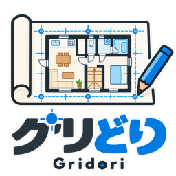

# グリどり（Gridori）

「グリどり」は、壁をグリッドに配置することで間取りを作図する、2Dのグリッド間取りエディタです。ブラウザで動作します。プロジェクト名は `gridori` です。

日本の家屋で使われる910mmモジュールを基本とし、壁・建具・住宅設備を配置して平面図を作成できます。

**バージョン：v0.1.0（MVP）**

基本的な作図・編集・JSON保存・印刷を備えた初回MVP（最低限の機能版）です。引き続き、操作性や描画・編集機能を改善していきます。

## v0.1.0でできること

- 910mm／455mmグリッドを使った壁・手すり壁の配置、数値編集、回転、接続スナップ
- 窓・固定窓・開き戸・引き戸・引き違い戸・折戸の配置
- 直線階段・踊り場・90°曲がり階段の作図
- ユニットバス・トイレ・洗面台・洗濯機の配置、部品を組み合わせたキッチンの作図
- 平行な壁の内寸・外寸の寸法線追加
- 図面データのJSON保存・読込、図面のみの印刷・PDF保存

## 起動方法

`index.html` をブラウザで開きます。 `model.js` と、サンプル用の `samples/` フォルダも一緒に配置してください。サーバーやビルドは不要です。

リポジトリをダウンロードまたはクローンし、展開したフォルダ内の `index.html` を開いてください。JavaScriptが有効なデスクトップブラウザで、マウスとキーボードを使って操作します。アプリの利用にNode.jsや依存パッケージのインストールは不要です。

## メニュー

ヘッダーの「☰ メニュー」から以下の機能を開けます。
* JSON保存
* JSON読込
* サンプル図面：アパート1DK
* 印刷／PDF
* 使い方
* このアプリについて・ライセンス

「使い方」と「このアプリについて・ライセンス」は画面内のダイアログで表示します。「閉じる」またはEscキーで閉じると、メニューから開いた場合はメニューボタンへ、図面上部の「図面サイズ」から開いた場合はそのボタンへフォーカスが戻ります。

※ ダイアログ内にREADME・ライセンス全文へのリンクがあります。ローカル利用時も参照できるよう、`README.md` と `LICENSE` を同じフォルダに置いてください。

## 最初の図面を作る

左ペインは作図用の部品追加、図面上部は拡大・縮小・表示倍率リセット、右ペインは選択部品の編集です。

1. 起動時にはサンプルの壁が2本表示されます。不要な壁は選択して削除します。
2. 左ペインの「＋ 壁」で壁を追加し、ドラッグで位置を決めます。
3. 右ペインで座標・長さ・角度・壁厚を入力し、「値を反映」を押します。
4. 窓・ドア・住宅設備などを追加します。壁を選んでから追加すると、その壁の位置や厚さを利用できる部品もあります。
5. 必要に応じて壁間の寸法線を追加します。選択した壁のIDは右ペインの情報の先頭で確認できます。
6. 「JSON保存」で編集用データを保存します。紙やPDFに出力する場合は「印刷 / PDF」を使います。

### 作図の基本操作

| 操作 | 方法 |
| --- | --- |
| 選択・移動 | 部品をクリック・ドラッグ |
| 選択解除 | 図面の空白部分をクリック |
| 数値で編集 | 右ペインの項目を入力し「値を反映」 |
| 壁を追加 | `W` |
| トイレ／浴室／キッチン作業台／ドアを追加 | `T`／`B`／`K`／`D` |
| 90°回転／逆方向に90°回転 | `R`／`Shift + R` |
| 座標入力へ移動 | `F2` |
| 削除 | `Delete` |
| 位置の微調整 | 矢印キー（91mm単位） |

入力欄の操作中は、作図用のショートカットは動作しません。

## 保存・読込

**自動保存はありません。ページを閉じたり再読み込みしたりする前に「JSON保存」を実行してください。**

- 「JSON保存」は編集可能な図面データを `gridori.json` としてダウンロードします。
- 「JSON読込」は現在の図面を読み込んだ図面に置き換えます。作業中の図面が必要な場合は先に保存してください。
- アプリのバージョン `v0.1.0` と、JSON内のデータ形式 `version: 3` は別の番号です。データ形式1・2の旧JSONも読込対象です。
- PDFはブラウザの印刷画面で「PDFに保存」等を選択して作成します。PDFから図面を再編集する機能はないため、JSONも保管してください。

## MVPの制限事項

- 元に戻す／やり直し、複数部品の一括選択・移動は未実装です。
- 壁接続は座標の一致で表現します。接続を維持した壁移動、端点ドラッグによる長さ変更、壁分割は未実装です。
- 建具・設備は独立した部品です。配置後の壁の移動・壁厚変更には自動追従しません。寸法線は参照する壁の変更に追従します。
- 階段やキッチンの組み合わせは、部品全体を一つのグループとして扱う機能ではありません。
- 内寸・外寸の測定対象は平行な2本の壁です。
- 図面領域外の部品は表示・印刷時に欠けます。「図面サイズ」で領域を広げるか、全体に合わせてください。印刷は用紙に合わせる方式で、固定縮尺やPNG出力には対応していません。
- 複数階の管理や3D表示には対応していません。
- 自動テストは計算・簡易DOMでの描画処理を対象としています。ブラウザ別の表示・操作・印刷の確認は網羅していません。

## サンプル図面と図面サイズ

メニューの「サンプル図面：アパート1DK」から、提供された1DKの間取りを読み込めます。現在の図面を置き換えるため、必要なら先にJSON保存してください。JSON単体は [samples/apartment-1dk.json](samples/apartment-1dk.json) です。配置は提供データのまま、玄関ドアの開閉範囲も収まる7,280×10,010mmの図面領域を設定しています。

図面上部の「図面サイズ」で幅・高さと左端X・上端Yをmm単位で変更できます。「部品・寸法線全体に合わせる」は描画全体に455mmの余白を付けて領域を設定します。部品の位置・寸法は変わりません。領域設定はJSONの page に保存します。領域設定のない旧JSONは12,000×8,500mmとして開きます。印刷でも設定した領域全体を用紙に収めます。

サンプルはJSONと、ローカル起動用の apartment-1dk.js に同じデータを保持しています。サンプルを更新する場合は両方を揃えてください。

## 壁芯グリッドモデル

壁の座標はmm単位の壁芯始点、設定長は壁芯端点間の距離です。壁の実体は両端へ壁厚の半分ずつ延長され、全長は設定長＋壁厚になります。回転は始点を中心に行います。

- 壁をドラッグすると455mmグリッドへ吸着します。両端点から182mm以内の既存壁端点を優先し、それがなければ壁芯途中へ吸着します。オレンジの丸が接続位置です。
- 設定長・壁厚・角度・座標は右ペインで直接入力できます。長さは±455mmボタン、回転はR／Shift+Rでも操作できます。矢印キーは従来どおり91mmの微調整です。
- JSONはversion 3の壁芯モデルで保存します。従来のversion 2と、version 1のobjects形式を読み込めます。旧壁のwidthは設定長として変換し、x/yは維持します。

L字・T字・十字の接続を壁芯基準で表現します。壁の設定長と、壁厚を含む描画上の全長は区別して管理します。

## 窓

「窓」は引き違い窓で、中央ですれ違う2枚のサッシを描画します。「固定窓」は分割のない連続したサッシです。どちらもオブジェクトの奥行き全体が開口で、中央の壁芯位置にサッシを配置します。

壁を選択して追加すると、壁の始点・角度・壁厚を引き継ぎます。未選択時の奥行きは140mmです。追加後は独立した部品なので、壁厚を変更した場合は窓の「壁厚・奥行き」も合わせて変更してください。新規窓のX/Yはサッシ芯の始点です。

## ドア

「ドア」（開き戸）、「引き戸」、「引き違い戸」、「折戸」を配置できます。窓と同じく、新規部品のX/Yは開口の壁芯始点です。壁を選んで追加すると位置・角度・壁厚を引き継ぎ、未選択時は奥行き140mmになります。追加後の壁との連動はなく、奥行きはプロパティで変更できます。

開き戸はプロパティで左開き・右開きと開く側を選び、「値を反映」で更新します。左右は角度0°の図における吊元の位置、開く側は上側・下側で指定します。回転すると扉と開閉円弧も一緒に回転します。引き戸は指定方向へ移動する1枚の戸、引き違い戸は重なる2枚の戸と移動方向の矢印で描画します。

引き戸は「開く方向」（左／右）と「戸が通る側」（壁の上／下）を選び、「値を反映」で変更できます。いずれも角度0°を基準にした設定で、回転すると戸と矢印も一緒に回転します。例えば右へ開く・上側を通る戸を90°回転すると、図では下へ開き、壁の右側を通ります。設定はJSONに保存され、従来データは右開き・上側として表示します。

「折戸」は2枚の戸を途中まで折った形と、畳む方向の矢印で表示します。「開く方向」で左／右どちらに畳むか、「折る側」で壁の上／下どちらへ折るかを選び、「値を反映」で更新します。角度0°基準の設定で、回転すると戸・折る側・矢印も一緒に回転します。壁を選んで追加すると壁芯位置・角度・壁厚を引き継ぎ、設定はJSONに保存されます。

## 階段

幅・高さは壁芯間寸法のまま保持し、描画は接続辺以外を「周囲の壁厚」の半分ずつ内側へ寄せます。階段は標準で上・下を接続辺とし、両端がグリッドに届きます（壁厚140mmなら従来より上下へ各70mm延長）。手動で指定した接続辺は維持します。標準の壁厚140mmなら左右各70mm、幅910mmなら描画幅770mmです。壁を選んで追加するとその壁厚を使います。周囲の壁とは自動連動せず、壁厚は階段のプロパティで変更できます。

「段数」で階段の分割数を指定します（初期値12）。内部線は段数−1本です。図中の「階段」の文字は表示せず、中央の矢印で上り方向を示します。上り方向は角度0°基準の上／下を指定でき、回転すると矢印も一緒に回ります。既存JSONの階段も壁厚140mm・12段・上向きの初期値で表示します。

## 踊り場と階段の接続

「踊り場」は初期寸法910×910mmの平らな床として追加できます。段線・文字・矢印は描きません。幅・高さ・壁厚・角度を編集できます。

階段と踊り場には「接続辺」の設定があります。チェックした辺は壁厚分の余白と枠線をなくします。例えば角度0°の階段の下に踊り場をつなぐ場合、階段の「下」と踊り場の「上」をチェックし、踊り場のXを階段と同じ、Yを階段のY＋高さに合わせます。接続辺の上下左右は角度0°基準で、回転に追従します。自動配置や接続を維持した移動は行いません。

接続辺が隣り合う角は、壁と重ならないよう一辺が壁厚の半分の切り欠きを設けます（壁厚140mmなら70×70mm）。階段の段線も切り欠きの手前までにします。対向する2辺だけを接続した場合は切り欠きません。小さい部品では切り欠きを描画幅・高さの半分までに制限します。

階段の上・下の接続端にも段線を描画します。内部線を段数−1本として、両端の線の間を指定段数に等分します。同じ位置で重なる接続端の段線は、回転後の座標でまとめて1本に描画します。幅が異なる場合の部分的な重なりにも対応します。踊り場には段線を追加しません。

## 90°曲がり階段

「＋ 90°曲がり階段」で初期寸法910×910mm・3段の回り階段を追加できます。段数、幅・高さ、壁厚、角度、右回り／左回りを編集できます。角度0°では下から入り、右または左へ上ります。段線は内角から放射状に分割し、上り矢印は90°の曲がりに沿って表示します。

入口・出口は自動的に接続辺となり、内角は壁厚の半分を切り欠きます。直線階段や踊り場の接続辺と座標を合わせて配置してください。接続端の段線は直線階段と共通の重複統合処理で描画します。設定はJSONで保存・読込できます。

## ユニットバス

ユニットバスの幅・高さは壁芯間寸法です。四辺を周囲の壁厚の半分ずつ内側へ寄せます。標準の壁厚140mmでは各辺70mmの余白になります。壁を選んで追加すると壁厚を引き継ぎ、後からプロパティで変更できます。

ユニットバス内にはバスタブを描画します。浴室全体を90°ずつ回転すると、バスタブの位置が上（0°）・右（90°）・下（180°）・左（270°）に変わります。右ペインの回転ボタン、角度入力、R／Shift+Rを使用できます。長方形の浴室は外形も一緒に回転します。既存JSONは壁厚140mmとして表示されます。

## トイレ

便器とタンクを上から見た図で表示します。新規トイレは幅380×奥行き650mmで、X/Yは全体の中心位置です。ドラッグ時には中心が910mmグリッドのマスの中心に吸着します。0°ではタンクが上、便器の正面が下です。回転ボタン、角度入力、R／Shift+Rで中心を固定して向きを変更できます。数値入力・矢印キーによる微調整も可能です。旧JSONは従来の位置・寸法を保持して描画します。

## 洗面台

背面の棚・鏡、洗面ボウル、水栓を上面図で表示します。新規寸法は幅750mm・奥行き約607mm（910mmの2/3）です。X/Yは背面中央で、ここを中心に回転します。回転ボタン・角度入力・R／Shift+Rが使用できます。

壁と平行になるよう回転してドラッグすると、背面が壁芯ではなく壁面へ吸着します（182mm以内）。壁を選択して追加すると、その壁の片側へ配置します。反対側に置く場合は180°回転して移動してください。幅が収まらない壁には吸着しません。配置後は独立した部品で、壁の移動や壁厚変更には自動追従しません。旧JSONの位置・寸法は保持します。

## 組み合わせキッチン

作業台・シンク台・コンロ台・コーナーを個別に追加できます。標準は幅750×奥行き600mm、コーナーは600×600mmです。シンクは水槽と水栓、コンロは3口の図で表示します。

キッチン部品を選んで次の部品を追加すると、列の進行方向に隙間なく並びます。通常は回転前基準の右隣へ追加し、コーナーを曲がった後は曲がった先へ列を延ばします。L字型はコーナーを追加し、プロパティの「右回り／左回りに作業台を追加」を使います。追加した作業台は種類をシンク台やコンロ台へ変更できます。各部品の寸法・角度は個別に編集可能です。未選択状態で追加すると独立した列を作れます。

新規部品のX/Yは背面中央です。洗面台と同じく平行な壁面へ背面が吸着します。部品同士の自動連結は追加時のみで、移動・寸法変更後の追従はありません。既存JSONのキッチンは従来の寸法・位置を保った一体型（シンク＋コンロ）として表示します。Kキーでは作業台を追加します。

キッチンのドラッグはグリッドに吸着せず、自由な位置に配置できます。壁面から182mm以内では壁に垂直な方向だけを補正し、壁に沿う位置は自由に動かせます。部品の辺全体が収まらない短い壁には吸着しません。

コーナーは背面と側面の2辺が壁側です。図中の太い青灰色の2辺で表示します。プロパティの「コーナーの壁側」で「背面（上）＋右側」または「背面（上）＋左側」を選び、「値を反映」で更新してください。方向は角度0°基準で、回転すると表示と吸着方向も一緒に回ります。直角の2本の壁に近づけると、両方の壁面へ同時に吸着します。壁側の設定もJSONに保存されます。

## 手すり壁

「＋ 手すり壁」で追加できます。通常の壁と同じ壁芯基準の配置・長さ・壁厚・回転・接続スナップを使用します。手すり壁は通常の壁より薄いダークグレーで描画し、重なる部分では追加順に関係なく通常の壁を手前に表示します。プロパティの「壁の種類」で相互に切り替えられます。種類はJSONに保存され、従来の壁データは通常の壁として読み込みます。

## 壁間の内寸・外寸

壁の設定長・表示長は図中に常時表示しません。壁を選択し、プロパティの「寸法の測定先」で別の平行な壁を選び、「内寸を追加」「外寸を追加」で寸法線を書き込めます。内寸は向かい合う壁面間、外寸は外側の壁面間の距離です。

右ペインの「寸法線」一覧から位置をmmで変更・削除できます。位置は最初の壁の始点から壁に沿った距離で、負の値も指定可能です。壁の位置・厚さに追従して再計算し、JSON保存・読込に対応します。参照壁を削除すると寸法線も削除します。平行でなくなった場合や内寸が負になる場合は測定不可として図中から非表示にします。

## 印刷 / PDF

「印刷 / PDF」またはブラウザの印刷操作で、図面部分のみをA4横1ページに収めて出力します。操作パネル・ヘッダー・ステータス・選択枠・壁芯端点の編集用マーカーは印刷しません。画面上のズームやスクロール位置には影響されません。用紙に合わせて縮小するため、固定縮尺の出力ではありません。ブラウザが付ける日時・URL等が不要な場合は印刷設定の「ヘッダーとフッター」をオフにしてください。

## テスト実行

検証は `node --test model.test.js` で実行します。壁形状・スナップ・JSON互換性と、最小DOM環境で実際のSVG描画処理・既存操作を確認します。

テストにはNode.jsが必要です。プロジェクトのフォルダで実行してください。外部パッケージのインストールは不要です。

```sh
node --version
node --test model.test.js
```

結果が `fail 0` ならすべて成功です。テストとは別に、`index.html` をブラウザで開き、ドラッグ・数値編集・JSON保存読込・印刷プレビューを確認してください。

## ファイル構成

| ファイル | 内容 |
| --- | --- |
| `index.html` | 画面・SVG描画・操作処理・印刷スタイル |
| `model.js` | mm単位の幾何計算・吸着・JSON読込検証 |
| `model.test.js` | 計算処理と簡易DOMを使った回帰テスト |
| `README.md` | 利用方法・機能・制限事項 |
| `LICENSE` | ライセンス全文 |

## 不具合・改善要望

リポジトリのIssuesへ、再現手順、期待する動作、実際の動作、OS・ブラウザの種類とバージョンを記載してください。再現用の図面JSONを添付する場合は、共有してよい内容か確認してください。

## ライセンス

GNU General Public License v3.0。詳細は [LICENSE](LICENSE) を参照してください。
